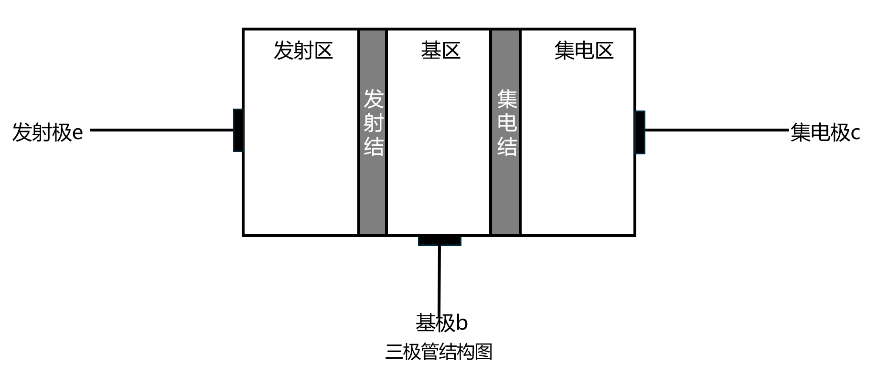
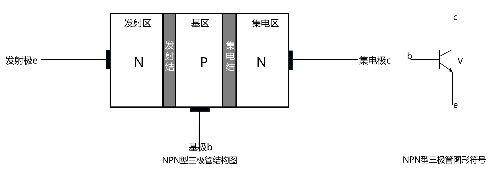
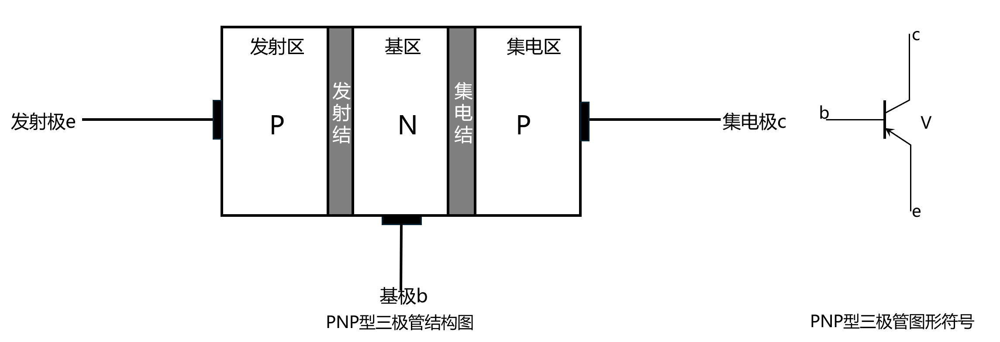

# 三极管的基本概念

Hello,EveryBody.我是Cat，现在我们来说说三级管的基本概念。

 ---

## 三极管的基本结构

三极管由**3个区**，**3个极**，**2个结**组成，它们的具体规则见下表。

==3个区==

| 结构 | 特点 | 功能 |
| --- | --- | --- |
| 发射区 | 掺杂浓度**大** | 向基区发射载流子 |
| 基区 | 参杂**少** | 让载流子通过 |
| 集电区 | 体积比发射区**大** 参杂**少** | 收集载流子 |

==3个极和2个结都是本身的含义==
3个极分别为**发射极**，**集电极**，**基极**。
2个结分别为**发射结**，**集电结**。
==注意：==**没有基结**

具体如下图所示

---

## NPN和PNP型三极管

学过二极管的都知道，二极管有一个PN结，那么三极管**也有PN结**，只不过有**两个**

### NPN型三极管

>其实NPN型很简单，从==命名来看==，它由**2个N区**，**一个P区**组成。
再根据它的==顺序来看==，不管从那个极开始，**P区**始终在中间，也就是**基极**的位置。

*所以，结论如下*

1. **NPN型三极管**的对照为**P - 基区**，**N - 发射区或集电区**（因为不管是发射区还是集电区都是P所在的位置。
2. 根据==P区和N区之间存在PN结==，得出三极管存在**2个PN结**，这2个PN结通常这样命名：**发射区**和**基区**交界的为==发射结==；**集电区**和**基区**交界的为==集电结==。

**电器符号：**

1. 文字符号：V
2. 图形符号：

### PNP型三极管

更具NPN得出的结论，PNP其实是差不多的。

>其实PNP型也很简单，从==命名来看==，它由**2个P区**，**一个N区**组成。
再根据它的==顺序来看==，不管从那个极开始，**N区**始终在中间，也就是**基极**的位置。

*所以，结论如下*

1. **PNP型三极管**的对照为**N - 基区**，**P - 发射区或集电区**（因为不管是发射区还是集电区都是P所在的位置。
2. 根据==P区和N区之间存在PN结==，得出三极管存在**2个PN结**，这2个PN结通常这样命名：**发射区**和**基区**交界的为==发射结==；**集电区**和**基区**交界的为==集电结==。

**电器符号：**

1. 文字符号：V
2. 图形符号：

---

## 三级管的分类

三极管的分类通常从**材料、结构、功率、频率和用途**几个主要维度来划分。

| 分类维度 | 主要类别 | 特点与说明 |
| --- | --- | --- |
| **按材料** | 硅管、锗管 | 硅管是当前应用最广的主流，热稳定性好；锗管较早期，开启电压低。 |
| **按结构（极性）** | **NPN型**、**PNP型** | 这是最核心的分类。两者工作原理相同，但电流方向和电压极性相反。 |
| **按功率** | 小功率管、中功率管、大功率管 | 主要依据耗散功率划分，大功率管通常需要配备散热片。 |
| **按工作频率** | 低频管、高频管、超高频管 | 不同频率的管子适用于不同的电路，例如高频管用于射频放大。 |
| **按功能/用途** | 开关管、功率管、达林顿管、光敏管、低噪声管等 | 为特定用途优化设计，比如达林顿管有极高的电流放大倍数，光敏管用于光电检测。 |
| **按安装方式** | 插件式、贴片式 | 插件式适合手工焊接和维修，贴片式体积小，是现代电子设备的主流。 |

---

好了，以上就是今天的全部内容，再见。

