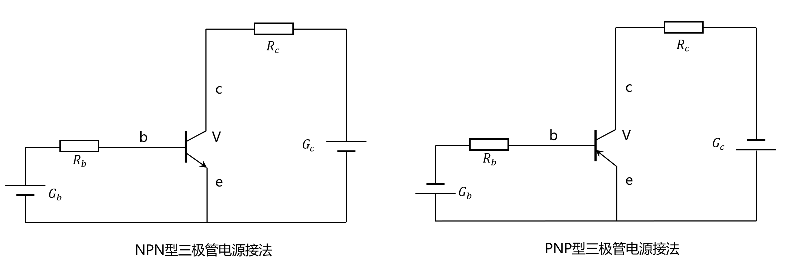
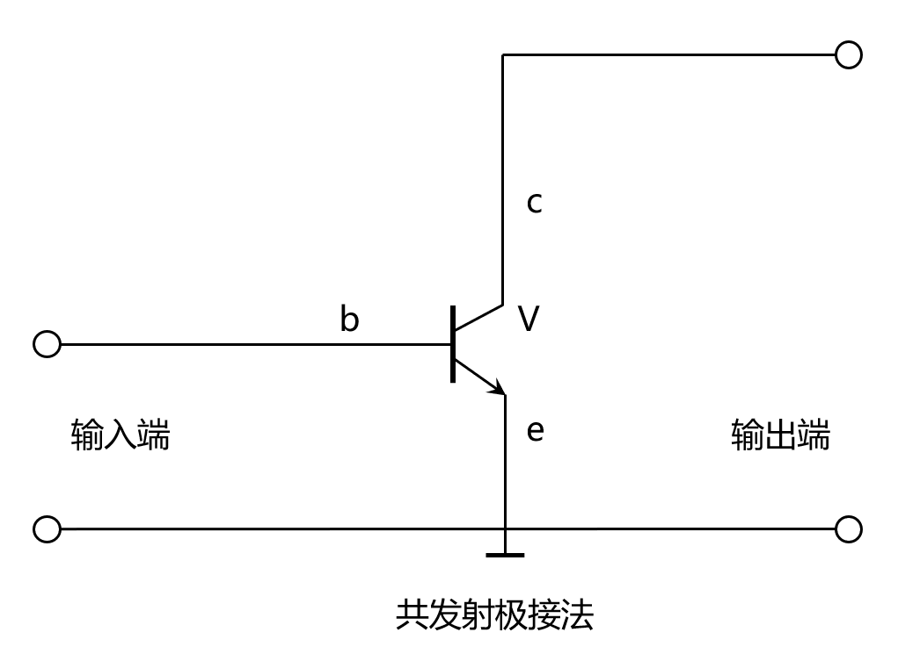
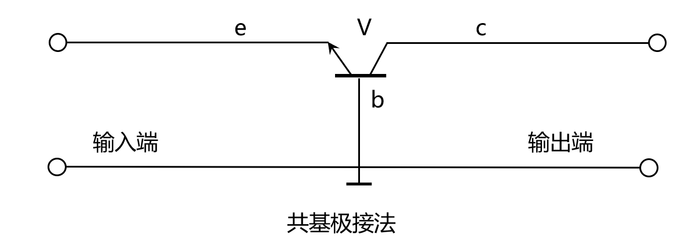
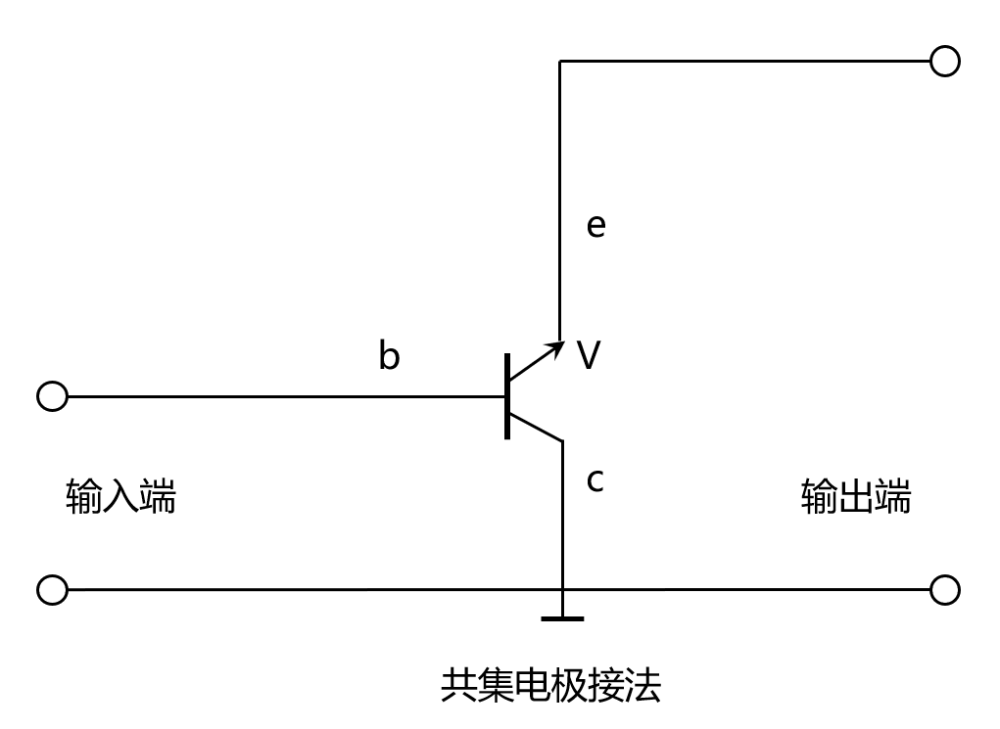

# 三极管的工作电压和基本连接方式

Hello,EveryBody.我是Cat，现在我们来说说三极管的工作电压和基本连接方式。

 ---

## 三极管的工作电压

三极管的放大条件为**发射结加正向电压，集电结加反向电压**。
==对此可以得出以下结论：==
>**NPN**：发射极(e)电位**低于**基极(b)电位
>**PNP**：发射极(e)电位**高于**基极(b)电位

---

## 三极管的偏置电压

**什么是三极管的偏置电压？**

三极管的偏置电压是指加在 **基极(b)** 和 **发射极(e)** 之间的电压。
> **硅管：** 0.5-0.8V
> **锗管：** 0.1-0.3V

==同时应该注意==：加载 **基极(b)** 和 **集电极(c)** 之间的电压一般为几V-几千V。

**了解了这么多，接下来来看看三极管的电源接法吧。**

---

## 三极管的电源接法

如图所示，这是有关 **PNP** 和 **NPN** 三极管的电源接法。

在此图中，有关解释见下：

| 符号 | 内容 |
| --- | --- |
| V | 三极管 |
| $G_C$ | 集电极电源 |
| $G_B$ | 基极（偏置）电源 |
| $R_b$ | 基极（偏置）电阻 |
| $R_c$ | 集电极电阻 |

---

## 三极管的电路基本连接方式

1. ==共发射极接法==

> **基极(b)**：输入端
> **集电极(c)**：输出端
> **发射极(e)**：输入，输出两回路的共同端
> 接法如图所示：

2. ==共基极接法==

> **基极(b)**：输入，输出两回路的共同端
> **集电极(c)**：输出端
> **发射极(e)**：输入端
> 接法如图所示：

3. ==共集电极接法==

> **基极(b)**：输入端
> **集电极(c)**：输入，输出两回路的共同端
> **发射极(e)**：输出端
> 接法如图所示：
