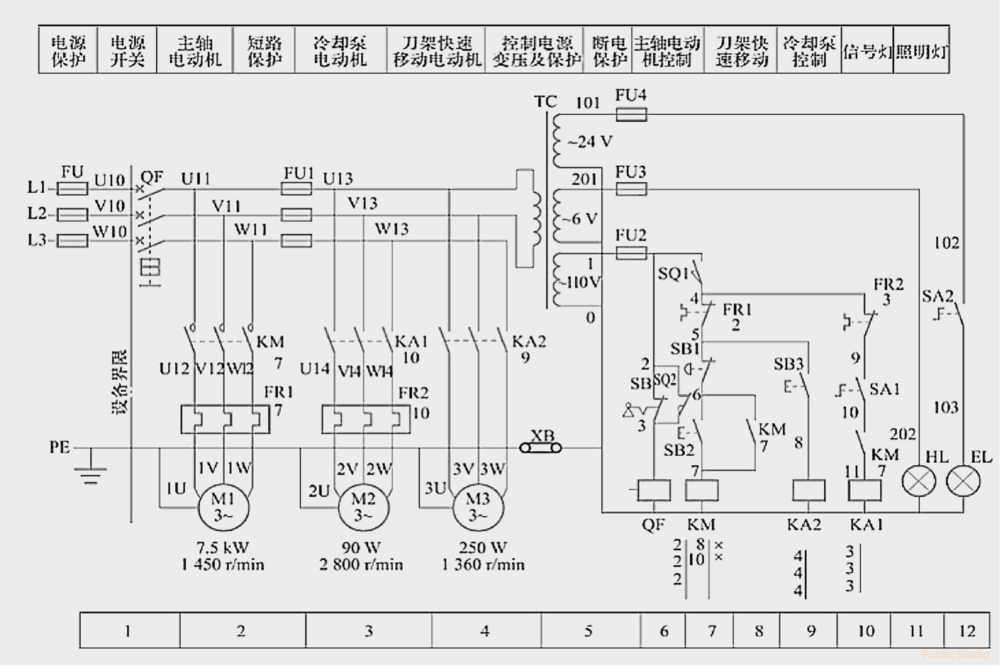
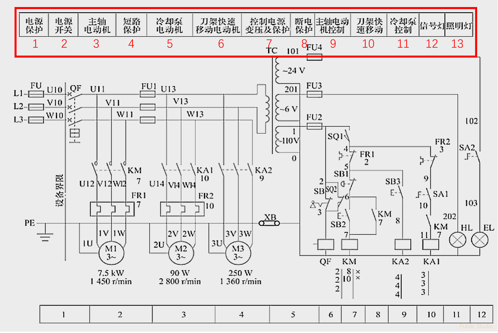
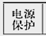
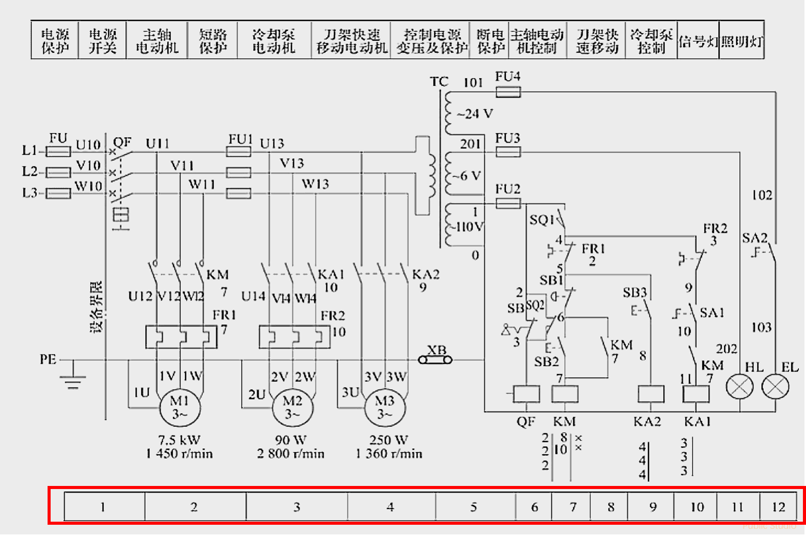
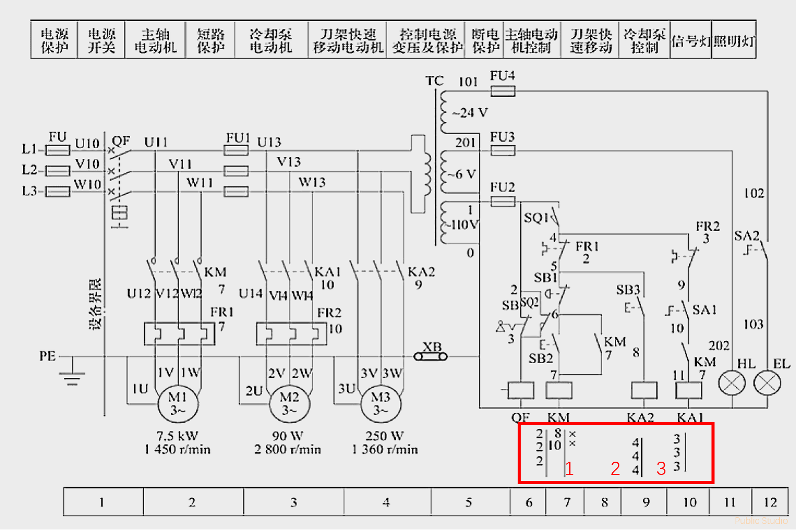
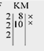
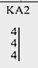
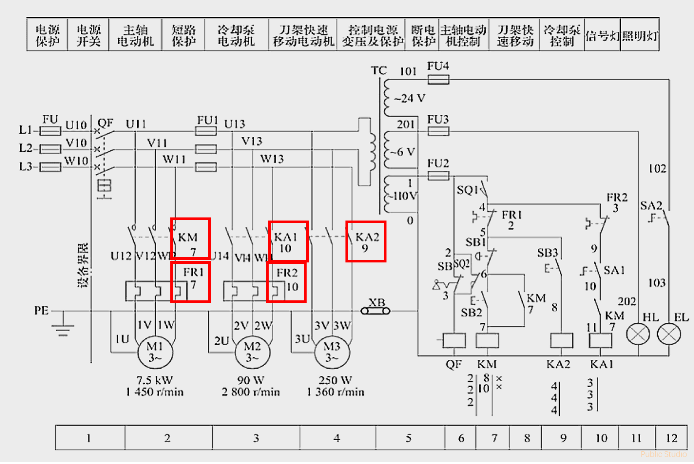
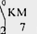

# 电路图的识读基础--CA6140车床电气控制线路原理图举例

---

Hello,EveryBody.我是Cat，现在我们来说说**电路图的识读基础**，我们使用**CA6140车床电气控制线路原理图**来举例。
今天我们只掌握识读基本方法，认识电路图，在下一次我们将进行**CA6140车床电气控制线路原理图**的**工作原理分析**。

## 如何识读

由于种种原因，机床的电器控制线路一般都比较复杂（通俗来讲：**电气元件**和**电气设备**较多。

**但是**，不用担心，因为所以的机床的基本电路都是差不多的。

至于如何识读，我的**个人**建议是**主电路**和**控制电路**一起看，**控制电路**的==优先级==*永远高于***主电路**。

---

## CA6140车床电气控制线路原理图

好了，接下来展示图纸：

这个就是CA6140车床电气控制线路原理图
同时，这张图也是**维修**，**接线**的重要理论依据

那么是不是需要机床实物呢，答案是**不需要**，==为什么呢？==
问这么多为什么干什么，说了==不用==就是==不用==，记住就行。

---

## 电路功能区域的划分

**划分作用**
便于分析机床电气控制线路的工作原理和明确各部分的功能。

**划分方法**
将机床电器控制线路原理图按电路功能划分成若干个单元，并用文字将其功能标注在控制线路原理图上部的栏内。

如下图所示，电路共分成**13个单元**。（红色框出来的部分）

这里==一个小格就叫做一个单元==，如下图所示的叫**一个单元**。

  

在图中，总共分13个单元，分别是：

> 1.电源保护
> 2.电源隔离开关
> 3.主轴电动机
> 4.短路保护
> 5.冷却泵电动机
> 6.刀架快速移动电动机
> 7.控制变压器及保护
> 8.断电保护
> 9.主轴电动机控制
> 10.刀架快速移动
> 11.冷却泵控制
> 12.信号灯
> 13.照明灯

---

## 电路图区的划分

**划分作用**
便于分析各种用电设备的主电路，控制回路和标注各电器元件的触点，线圈等在电路图中的位置。

**划分方法**
在机床电气控制线路原理图的下部或者上部，按一条回路或一条支路为单位划分成若干图区，从左向右依次用阿拉伯数字编号标注在图区栏。

==**注意**==：**无论是哪个机床的电路图，它的所有的电路图区和电路功能区域都是互斥的，只能一个在上，一个在下，不能一起**

如下图所示，电路共分成**12个图区**。（红色框出来的部分）

这里==一个小格就叫做一个图区==，如下图所示的叫**一个图区**。

  

---

##  电气元件线圈下方该元件触点所属图区号的标注

**划分作用**
在机床电气控制线路原理图中，为了方便快速理解电路图，对于有线圈电器元件，他们的线圈下方要标注该元件触点所属图区号。

**划分原因**
因为我们所说的原理图，它是一个控制电路与主电路分离的电路图，所以一个元器件可能在电路图中多次显示，为了方便查找，我们需要在下方标注与便快速查找。

如下图红框框出来的地方所示这就是序号的标注

在ca6140车床电器控制线路原理图中总共运用了三个地方的区号标注。
一个区号的标注如下图所示：

  

  

==**注意**：他们都标注在**线圈下方**。==

**划分规则**
在原理图中
对于**每个接触器**，其线圈下方画出**两条竖直线**，分成**左**、**中**、**右**三栏。
对于**每个继电器**，在线圈下方画出**一条竖直线**，分成**左**、**右**两栏。
将受其线圈控制而动作的各个触点所处的图区号填入相应的栏内，==对备而未用的触点（也就是存在，但是没有接任何线路，没有启用）==，在相应的栏内用记号**“x”**==标出==或==不标出==**任何符号**。

**接触器标注方法**

| 栏目 | 左栏 | 中栏 | 右栏 |
| --- | --- | --- | --- |
| 触点类型 | 主触点所处图区号 | 辅助动合触点所处图区号 | 辅助动断触点所处图区号 |
| 举例  | 表示 3 对主触点均在“2”号图区 | 表示一对辅助动合触点在“8”号图区，另一对动合触点在“10”号图区 |表示 2 对辅助动断触点均未用 | 

**继电器标注方法**

| 栏目 | 左栏 | 右栏 |
| --- | --- | --- |
| 触点类型 | 动合触点所处图区号 | 动断触点所处图区号 |
| 举例  | 表示 3 对动合触点均在“4”号图区 | 表示动断触点均未用 |

---

##  电气元件触点文字符号下方线圈图区号的标注

**划分作用**
在机床电气控制线路原理图中，为了方便快速理解电路图，对于接触器，中间继电器等电器元件，他们的触点文字符号下方用阿拉伯数字标注线圈图区号。

**划分原因**
因为我们所说的原理图，它是一个控制电路与主电路分离的电路图，所以一个元器件可能在电路图中多次显示，为了方便查找，我们需要在下方标注与便快速查找。

如下图红框框出来的地方所示这就是序号的标注

在ca6140车床电器控制线路原理图中总共运用了若干地方的区号标注。
一个区号的标注如下图所示：

  

==**注意**：他们都标注在**文字符号下方**。==

---

好了，以上就是今天的全部内容，下一次我们将进行**CA6140车床电气控制线路原理图**的**工作原理分析**，再见。
更多精彩内容请访问 publicstudio.dpdns.org

# 重磅消息

同时，我们正在构建**AI项目论坛**，有意者可通过==cat20262026@126.com==联系。有经验丰富的AI编程经验者优先考虑。

